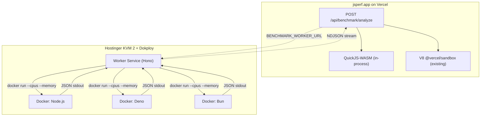

# Docker Multi-Runtime Benchmark Analysis

## Design Principle: Additive, Not Replacement

The existing Deep Analysis pipeline (QuickJS-WASM + V8 via `@vercel/sandbox`) stays **fully intact**. The Docker multi-runtime analysis is a **new, optional layer** enabled by setting `BENCHMARK_WORKER_URL`. If the worker is down or unconfigured, everything works exactly as today.

## Current State

The Deep Analysis pipeline in [lib/engines/runner.js](lib/engines/runner.js) orchestrates two engines:
- **QuickJS-WASM** ([lib/engines/quickjs.js](lib/engines/quickjs.js)) -- deterministic interpreter, runs in-process
- **V8/Node 24** ([lib/engines/v8sandbox.js](lib/engines/v8sandbox.js)) -- JIT profiling via `@vercel/sandbox`

Current resource profiles in `runner.js`:

```javascript
const RESOURCE_PROFILES = [
  { label: '1x', resourceLevel: 1, memoryLimit: 16 * 1024 * 1024, vcpus: 1 },
  { label: '2x', resourceLevel: 2, memoryLimit: 32 * 1024 * 1024, vcpus: 1 },
  { label: '4x', resourceLevel: 4, memoryLimit: 64 * 1024 * 1024, vcpus: 1 },
  { label: '8x', resourceLevel: 8, memoryLimit: 128 * 1024 * 1024, vcpus: 1 },
]
```

## Resource Profile Alignment

The 1x/2x/4x/8x labels and `resourceLevel` stay consistent. Docker maps them via `--cpus` and `--memory`:

- **QuickJS-WASM** (existing) -- WASM memory limit: 16 / 32 / 64 / 128 MB
- **V8 Sandbox** (existing) -- vcpus=1 across all profiles
- **Docker containers** (new) -- CPU + memory via cgroup limits:

```javascript
const DOCKER_PROFILES = [
  { label: '1x', resourceLevel: 1, cpus: 0.5, memMb: 256 },
  { label: '2x', resourceLevel: 2, cpus: 1.0, memMb: 512 },
  { label: '4x', resourceLevel: 4, cpus: 1.5, memMb: 1024 },
  { label: '8x', resourceLevel: 8, cpus: 2.0, memMb: 2048 },
]
```

The Hostinger KVM 2 has 2 vCPUs / 8GB RAM. Containers run sequentially (one at a time), so even the 8x profile (2 CPUs, 2GB) is safe. The host OS + Dokploy + worker service use ~1GB, leaving ~7GB headroom.

## Architecture



Solid lines = always runs. Dashed = only when `BENCHMARK_WORKER_URL` is set. Dokploy manages the worker service (Traefik reverse proxy, SSL, auto-restart). Benchmark containers are ephemeral -- spawned per run, destroyed after.

## What Each Engine Tells You

- **QuickJS-WASM** -- pure algorithmic cost, no JIT, deterministic
- **V8 Sandbox** -- V8 JIT on Vercel infra
- **Docker Node** -- V8 JIT on dedicated hardware with perf counters, resource scaling
- **Docker Deno** -- same V8 as Node, different runtime overhead / stdlib / startup
- **Docker Bun** -- JavaScriptCore (JSC), fundamentally different JIT from V8

## Part 1: Worker Service

### Directory structure

```
worker/
  package.json
  server.js              # Hono HTTP API
  docker.js              # Docker container lifecycle (spawn, collect, destroy)
  runtimes/
    common.js            # Shared benchmark loop template (time-sliced samples)
    node.js              # Node.js script builder
    deno.js              # Deno script builder
    bun.js               # Bun script builder
  images/
    Dockerfile.node      # FROM node:22-alpine + perf tools
    Dockerfile.deno      # FROM denoland/deno:alpine + perf tools
    Dockerfile.bun       # FROM oven/bun:alpine + perf tools
  Dockerfile             # Worker service itself (for Dokploy deployment)
  docker-compose.yml     # Optional: local dev
```

### Worker API contract (aligned to 1x/2x/4x/8x)

```
POST /api/run
Authorization: Bearer <WORKER_SECRET>
Content-Type: application/json

{
  "code": "...",
  "setup": "...",
  "teardown": "...",
  "timeMs": 1500,
  "runtimes": ["node", "deno", "bun"],
  "profiles": [
    { "label": "1x", "resourceLevel": 1, "cpus": 0.5, "memMb": 256 },
    { "label": "2x", "resourceLevel": 2, "cpus": 1.0, "memMb": 512 },
    { "label": "4x", "resourceLevel": 4, "cpus": 1.5, "memMb": 1024 },
    { "label": "8x", "resourceLevel": 8, "cpus": 2.0, "memMb": 2048 }
  ]
}

Response: NDJSON stream
{ "type": "progress", "runtime": "node", "profile": "1x", "status": "running" }
{ "type": "result", "runtime": "node", "profile": "1x", "data": { ... } }
...
```

### Docker container lifecycle (per benchmark)

For each runtime x profile combination (sequentially to avoid contention):

1. Write benchmark script to a temp file on the host
2. `docker run` with resource limits and capabilities:

```bash
docker run --rm \
  --cpus=1.0 --memory=512m \
  --network none \
  --cap-add SYS_PTRACE --cap-add SYS_ADMIN \
  --security-opt seccomp=unconfined \
  -v /tmp/bench-<id>.js:/bench.js:ro \
  jsperf-node:latest \
  node --expose-gc /bench.js
```

3. Collect JSON from stdout
4. Enforce timeout via `AbortSignal` + `docker kill`
5. Clean up temp file

Key flags:
- `--cpus` + `--memory` -- cgroup resource limits matching the profile
- `--network none` -- no network access for benchmark code
- `--cap-add SYS_PTRACE --cap-add SYS_ADMIN` -- enables `perf stat` inside the container
- `--security-opt seccomp=unconfined` -- needed for perf counters
- `--rm` -- auto-remove container after exit

### Docker images

Three lightweight images pre-built on the VPS:

**`jsperf-node:latest`** (Dockerfile.node):
```dockerfile
FROM node:22-alpine
RUN apk add --no-cache perf
USER node
ENTRYPOINT ["node"]
```

**`jsperf-deno:latest`** (Dockerfile.deno):
```dockerfile
FROM denoland/deno:alpine
RUN apk add --no-cache perf
USER deno
ENTRYPOINT ["deno", "run", "--allow-hrtime"]
```

**`jsperf-bun:latest`** (Dockerfile.bun):
```dockerfile
FROM oven/bun:alpine
RUN apk add --no-cache perf
USER bun
ENTRYPOINT ["bun", "run"]
```

### Runtime-specific benchmark scripts

All three share the same time-sliced loop structure but differ in APIs:

- **Node.js**: `perf_hooks.performance`, `v8.getHeapStatistics()`, `process.memoryUsage()`, `process.cpuUsage()`, `--expose-gc`
- **Deno**: `performance.now()`, `Deno.memoryUsage()`, `--v8-flags=--expose-gc`
- **Bun**: `performance.now()`, `Bun.nanoseconds()`, `process.memoryUsage()`, `bun:jsc` heap stats

### Metrics collected

Timing + memory (from the runtime):
- ops/sec, latency percentiles (mean, p50, p99, min, max)
- Heap used, heap total, external memory, RSS
- GC pauses (via `--trace-gc` flag parsing)
- Startup time (process spawn to first iteration)

Hardware perf counters (via `perf stat` wrapper inside the container):
- instructions, cycles, cache-misses, branch-misses
- context switches

The benchmark script is wrapped: `perf stat -e instructions,cycles,cache-misses,branch-misses -x, -- node --expose-gc /bench.js`, then parse both the JSON from stdout and the perf CSV from stderr.

## Part 2: jsperf.app Changes

### New engine file: `lib/engines/multiruntime.js`

New file alongside `v8sandbox.js` (which stays untouched):

```javascript
export async function runMultiRuntime(code, {
  setup, teardown, timeMs, runtimes, profiles, signal, onProgress,
}) {
  const workerUrl = process.env.BENCHMARK_WORKER_URL
  if (!workerUrl) return null

  const response = await fetch(workerUrl + '/api/run', {
    method: 'POST',
    headers: {
      'Content-Type': 'application/json',
      'Authorization': `Bearer ${process.env.BENCHMARK_WORKER_SECRET}`,
    },
    body: JSON.stringify({ code, setup, teardown, timeMs, runtimes, profiles }),
    signal,
  })
  // Parse NDJSON stream, call onProgress per line
  // Return { node: { profiles, avgOpsPerSec, perfCounters }, deno: {...}, bun: {...} }
}
```

### Updated runner.js -- additive Phase 4

Existing flow is **unchanged**. New Phase 4 appended:

```
Phase 1: QuickJS-WASM for all tests (UNCHANGED)
Phase 2: V8 Sandbox for all tests (UNCHANGED)
Phase 3: Build predictions (UNCHANGED)
Phase 4: Multi-runtime (NEW, only when BENCHMARK_WORKER_URL is set)
  For each test:
    - runMultiRuntime() with ["node", "deno", "bun"] x 4 profiles
  Wrapped in try/catch -- failure = null, not a crash
```

Results shape gains an optional `multiRuntime` field:

```javascript
results.push({
  testIndex: i,
  title: test.title,
  quickjs: { /* unchanged */ },
  v8: { /* unchanged */ },
  prediction,   // unchanged
  // NEW -- null when worker is not configured or call failed
  multiRuntime: {
    node: {
      avgOpsPerSec: 125000,
      profiles: [
        { label: '1x', resourceLevel: 1, opsPerSec, latency, heapUsed, perfCounters },
        ...
      ],
    },
    deno: { avgOpsPerSec, profiles: [...] },
    bun:  { avgOpsPerSec, profiles: [...] },
  }
})
```

### Updated prediction model ([lib/prediction/model.js](lib/prediction/model.js))

- `buildPrediction()` stays the same (QuickJS + V8 as canonical)
- New: `buildRuntimeComparison(multiRuntime)` -- produces:
  - Cross-runtime rankings (Node vs Deno vs Bun on identical hardware)
  - Per-runtime scaling curves across 1x/2x/4x/8x
  - V8 vs JSC divergence detection
- `compareTests()` stays the same

### Updated API ([pages/api/benchmark/analyze.js](pages/api/benchmark/analyze.js))

- `@vercel/sandbox` stays as a dependency
- New optional env vars: `BENCHMARK_WORKER_URL`, `BENCHMARK_WORKER_SECRET`
- New progress event: `{ engine: 'multi-runtime', status: 'running' }` after V8 phase
- If worker is unreachable, log warning and return results without `multiRuntime`

### Updated UI ([components/DeepAnalysis.js](components/DeepAnalysis.js))

Existing components **untouched**. New components render below when `multiRuntime` data is present:

- `ANALYSIS_STEPS` gets one optional step: "Multi-Runtime Comparison"
- [components/CanonicalResult.js](components/CanonicalResult.js) and [components/JITInsight.js](components/JITInsight.js) -- **unchanged**
- New component: **RuntimeComparison**:
  - Bar chart of Node vs Deno vs Bun ops/sec
  - Scaling chart showing how each runtime responds to 1x/2x/4x/8x
  - V8 vs JSC engine insight callout
  - Perf counter badges (instructions/op, cache miss rate)
- New component: **PerfCounters** -- collapsible hardware metrics table

### Cache key

- Existing `analysis_v2:` untouched
- Multi-runtime: `multiruntime_v1:${codeHash}` with 1-hour TTL
- Core analysis served from cache instantly; multi-runtime fetched independently

## Part 3: Deployment via Dokploy

### Worker service deployment

1. Push `worker/` to a Git repo (or subdirectory of jsperf.app)
2. In Dokploy: create a new Application, point to the repo
3. Dokploy builds the worker `Dockerfile`, runs it as a container
4. Traefik (managed by Dokploy) handles reverse proxy + SSL on a subdomain like `bench.yourdomain.com`

### Pre-build runtime images on the VPS

SSH into the Hostinger VPS and build the three benchmark images:

```bash
docker build -t jsperf-node:latest -f images/Dockerfile.node .
docker build -t jsperf-deno:latest -f images/Dockerfile.deno .
docker build -t jsperf-bun:latest -f images/Dockerfile.bun .
```

These are tiny Alpine images, built once and updated when you want to bump runtime versions.

### Worker container needs Docker socket access

The worker service spawns Docker containers, so it needs access to the Docker socket:

```yaml
# In Dokploy's advanced settings or docker-compose override:
volumes:
  - /var/run/docker.sock:/var/run/docker.sock
```

### Security

- Bearer token auth on the worker API
- Benchmark containers run with `--network none` (no outbound access)
- Benchmark code runs as non-root user inside containers
- Worker rate limits: max 1 concurrent analysis, queue overflow returns 503
- Docker socket access is the main trust boundary -- the worker service is trusted code

## Graceful Degradation

- **No `BENCHMARK_WORKER_URL` set** -- existing analysis only, no multi-runtime in UI
- **Worker URL set but worker is down** -- core analysis completes, multi-runtime shows "unavailable"
- **Worker healthy** -- full analysis: QuickJS + V8 + Node/Deno/Bun comparison
- **One runtime container fails** -- that runtime shows "errored", others display normally
- **Docker image missing** -- that runtime is skipped with error, others still run

## Implementation Order

1. **Worker service** -- develop locally with Docker, test the API
2. **Docker images** -- build the three runtime images
3. **App integration** -- add `lib/engines/multiruntime.js`, Phase 4 in runner, new UI. Ship with env var unset = zero behavior change
4. **Deploy via Dokploy** -- push to repo, create application, configure Docker socket mount
5. **Flip the switch** -- set `BENCHMARK_WORKER_URL` + `BENCHMARK_WORKER_SECRET` in Vercel
