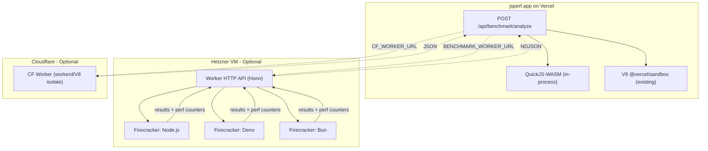

# Multi-Environment Benchmark Analysis

## Design Principle: Additive, Not Replacement

The existing Deep Analysis pipeline (QuickJS-WASM + V8 via `@vercel/sandbox`) stays **fully intact** as the primary analysis path. Each additional environment (Firecracker, CF Worker) is a **new, independently optional layer**. Each is enabled by its own env var and can go down without affecting anything else.

## Current State

The Deep Analysis pipeline in [lib/engines/runner.js](lib/engines/runner.js) orchestrates two engines:
- **QuickJS-WASM** ([lib/engines/quickjs.js](lib/engines/quickjs.js)) -- deterministic interpreter, runs in-process
- **V8/Node 24** ([lib/engines/v8sandbox.js](lib/engines/v8sandbox.js)) -- JIT profiling via `@vercel/sandbox` (Firecracker on Vercel's infra)

Current resource profiles in `runner.js`:

```javascript
const RESOURCE_PROFILES = [
  { label: '1x', resourceLevel: 1, memoryLimit: 16 * 1024 * 1024, vcpus: 1 },
  { label: '2x', resourceLevel: 2, memoryLimit: 32 * 1024 * 1024, vcpus: 1 },
  { label: '4x', resourceLevel: 4, memoryLimit: 64 * 1024 * 1024, vcpus: 1 },
  { label: '8x', resourceLevel: 8, memoryLimit: 128 * 1024 * 1024, vcpus: 1 },
]
```

The API endpoint [pages/api/benchmark/analyze.js](pages/api/benchmark/analyze.js) calls `runAnalysis()` and streams NDJSON progress to the client. Results are cached in Redis and persisted to MongoDB.

## Resource Profile Alignment

The 1x/2x/4x/8x scaling maps differently to each environment, but the `resourceLevel` and `label` stay consistent across all of them:

- **QuickJS-WASM** (existing) -- scales by WASM memory limit: 16MB / 32MB / 64MB / 128MB
- **V8 Sandbox** (existing) -- all run at vcpus=1 (Vercel Sandbox constraint)
- **Firecracker** (new) -- scales by VM memory: 256MB / 512MB / 1024MB / 2048MB, vcpus: 1 / 1 / 2 / 2
- **Cloudflare Workers** (new) -- **single run only**, no scaling profiles (fixed-resource V8 isolate)

```javascript
const FIRECRACKER_PROFILES = [
  { label: '1x', resourceLevel: 1, vcpus: 1, memMb: 256 },
  { label: '2x', resourceLevel: 2, vcpus: 1, memMb: 512 },
  { label: '4x', resourceLevel: 4, vcpus: 2, memMb: 1024 },
  { label: '8x', resourceLevel: 8, vcpus: 2, memMb: 2048 },
]
// CF Workers: single run, no profiles
```

## Architecture Overview



Solid lines = always runs. Dashed lines = only when the corresponding env var is set. Each environment is called in **parallel** during Phase 4 to minimize total analysis time.

## What Each Environment Tells You

- **QuickJS-WASM** -- pure algorithmic cost, no JIT, deterministic
- **V8 Sandbox** -- how V8 JIT optimizes the code on dedicated Vercel infra
- **Firecracker Node/Deno/Bun** -- cross-runtime comparison on identical hardware (same CPU, same kernel), with hardware perf counters
- **Cloudflare Workers** -- real-world edge performance in a V8 isolate with cold/warm start, memory pressure from shared isolate pool

## Hetzner VM Selection

A **CCX23** (4 dedicated AMD vCPUs, 16 GB RAM, ~25 EUR/mo) is recommended:
- **Dedicated vCPUs** -- critical for stable benchmark numbers; shared vCPU instances (CPX) have noisy neighbor variance
- `/dev/kvm` is exposed on Hetzner Cloud -- Firecracker requires it
- 4 vCPUs / 16 GB supports the 8x profile (2 vCPUs, 2048MB per VM) with room for the host
- Could start with CCX13 (2 vCPUs, 8GB, ~13 EUR/mo) and only run up to 4x profiles initially

## Part 1a: Hetzner Firecracker Worker

A standalone Node.js service (Hono + node:child_process) that manages Firecracker VMs.

### Directory structure (new repo or subdirectory)

```
worker/
  server.js            # Hono HTTP API
  firecracker.js       # Firecracker VM lifecycle (create, run, destroy)
  runtimes/
    node.js            # Node.js benchmark script builder
    deno.js            # Deno benchmark script builder
    bun.js             # Bun benchmark script builder
    common.js          # Shared benchmark loop logic (time-sliced samples)
  rootfs/
    build-rootfs.sh    # Script to build Alpine rootfs images
    Dockerfile.node    # Node rootfs builder
    Dockerfile.deno    # Deno rootfs builder
    Dockerfile.bun     # Bun rootfs builder
  vmlinux              # Linux kernel binary for Firecracker
  config/
    vm-template.json   # Firecracker VM config template
  setup.sh             # VM provisioning script
```

### Worker API contract (aligned to 1x/2x/4x/8x)

```
POST /api/run
Authorization: Bearer <WORKER_SECRET>
Content-Type: application/json

{
  "code": "...",
  "setup": "...",
  "teardown": "...",
  "timeMs": 1500,
  "runtimes": ["node", "deno", "bun"],
  "profiles": [
    { "label": "1x", "resourceLevel": 1, "vcpus": 1, "memMb": 256 },
    { "label": "2x", "resourceLevel": 2, "vcpus": 1, "memMb": 512 },
    { "label": "4x", "resourceLevel": 4, "vcpus": 2, "memMb": 1024 },
    { "label": "8x", "resourceLevel": 8, "vcpus": 2, "memMb": 2048 }
  ]
}

Response: NDJSON stream
{ "type": "progress", "runtime": "node", "profile": "1x", "status": "running" }
{ "type": "result", "runtime": "node", "profile": "1x", "data": { ... } }
...
```

### Firecracker VM lifecycle (per benchmark invocation)

1. Select pre-built rootfs for the target runtime
2. Write benchmark script to a scratch ext4 overlay (or use MMDS/vsock)
3. Start Firecracker process with the VM config (vcpus, mem from profile)
4. VM boots (~125ms with minimal kernel), runs the benchmark, writes JSON to vsock/serial
5. Collect results, kill the Firecracker process
6. Target overhead: <500ms boot + benchmark time

### Runtime-specific benchmark scripts

All three runtimes share the same benchmark loop (time-sliced, samples-based) but differ in APIs:

- **Node.js**: `perf_hooks.performance`, `v8.getHeapStatistics()`, `process.memoryUsage()`, `--expose-gc`
- **Deno**: `performance.now()`, `Deno.memoryUsage()`, `--v8-flags=--expose-gc`
- **Bun**: `performance.now()`, `Bun.nanoseconds()` for high-res, `process.memoryUsage()`, `bun:jsc` for JSC heap stats

### Rich metrics (the real payoff of self-hosted Firecracker)

Since we control the full VM:

- **CPU counters** via `perf stat -e instructions,cycles,cache-misses,branch-misses`
- **Startup time** -- process spawn to first iteration
- **GC pauses** -- `--trace-gc` (V8), `bun:jsc` GC events
- **JIT compilation time** -- `--trace-opt` / `--trace-deopt` (V8), JSC tier-up
- **RSS/PSS** from `/proc/<pid>/smaps`
- **Context switches** from `/proc/<pid>/status`

## Part 1b: Cloudflare Worker Runner

A deployed Cloudflare Worker that accepts benchmark code and runs it in a workerd V8 isolate.

### What it gives you

CF Workers are a fundamentally different execution model: V8 isolates (not a full OS process), shared memory pool, 128MB limit, edge deployment. This answers "how does this code behave on the edge?"

### Setup

- **Wrangler project** in `runners/cloudflare/`
- Single `POST /` endpoint that accepts `{ code, setup, teardown, timeMs }`
- Uses the same time-sliced benchmark loop adapted for the Workers API
- Returns JSON with ops/sec, latency percentiles, memory stats from `caches` API / performance API
- **No scaling profiles** -- CF Workers are fixed-resource, so a single run per benchmark
- Auth via a shared secret in the `Authorization` header (stored as a CF Worker secret)
- Deployed via `wrangler deploy`

### Benchmark script differences

- No `v8.getHeapStatistics()` (not available in workerd)
- No `process.memoryUsage()` -- use `performance.now()` for timing only
- No GC control -- cannot `--expose-gc`
- `performance.now()` resolution may be coarsened for security (timing attacks)
- Cold start measurement: first request after deploy vs subsequent warm requests

### Result shape

```javascript
{
  environment: 'cloudflare-worker',
  runtime: 'workerd',
  opsPerSec: 42000,
  latency: { mean, p50, p99, min, max },
  coldStartMs: 12,    // first invocation overhead
  region: 'fra1',     // CF colo the request landed on
  state: 'completed',
}
```

## Part 2: jsperf.app Changes

### Two new engine files (alongside existing `v8sandbox.js` which stays untouched)

**`lib/engines/firecracker.js`** -- calls the Hetzner worker, parses NDJSON stream:

```javascript
export async function runOnFirecracker(code, {
  setup, teardown, timeMs, runtimes, profiles, signal, onProgress,
}) {
  const workerUrl = process.env.BENCHMARK_WORKER_URL
  if (!workerUrl) return null

  const response = await fetch(workerUrl + '/api/run', {
    method: 'POST',
    headers: {
      'Content-Type': 'application/json',
      'Authorization': `Bearer ${process.env.BENCHMARK_WORKER_SECRET}`,
    },
    body: JSON.stringify({ code, setup, teardown, timeMs, runtimes, profiles }),
    signal,
  })
  // Parse NDJSON stream, call onProgress, return { node: {...}, deno: {...}, bun: {...} }
}
```

**`lib/engines/cfworker.js`** -- calls the deployed CF Worker (single run, no profiles):

```javascript
export async function runOnCFWorker(code, { setup, teardown, timeMs, signal }) {
  const url = process.env.CF_WORKER_URL
  if (!url) return null

  const response = await fetch(url, {
    method: 'POST',
    headers: {
      'Content-Type': 'application/json',
      'Authorization': `Bearer ${process.env.CF_WORKER_SECRET}`,
    },
    body: JSON.stringify({ code, setup, teardown, timeMs }),
    signal: signal || AbortSignal.timeout(timeMs + 15_000),
  })
  return response.json()  // single result object
}
```

### Updated runner.js -- additive Phase 4

The existing flow (Phase 1: QuickJS, Phase 2: V8 Sandbox, Phase 3: Prediction) is **unchanged**. A new Phase 4 runs all configured environments **in parallel**:

```
Phase 1: QuickJS-WASM for all tests (UNCHANGED)
Phase 2: V8 Sandbox for all tests (UNCHANGED)
Phase 3: Build predictions (UNCHANGED)
Phase 4: Multi-environment (NEW, parallel, each independently optional)
  For each test, run concurrently:
    - runOnFirecracker() with ["node", "deno", "bun"] x 4 profiles
    - runOnCFWorker() single run
  Wrap each in try/catch -- failure = null, not a crash
```

The results shape gains an optional `environments` field:

```javascript
results.push({
  testIndex: i,
  title: test.title,
  quickjs: { /* unchanged */ },
  v8: { /* unchanged */ },
  prediction,   // unchanged
  // NEW -- each key is null when its env var is not set or the call failed
  environments: {
    firecracker: {
      node: { profiles: [...], avgOpsPerSec, perfCounters },
      deno: { profiles: [...], avgOpsPerSec, perfCounters },
      bun:  { profiles: [...], avgOpsPerSec, perfCounters },
    },
    cfWorker: {
      opsPerSec, latency, coldStartMs, region, runtime: 'workerd',
    },
  }
})
```

### Updated prediction model ([lib/prediction/model.js](lib/prediction/model.js))

- `buildPrediction()` stays the same (QuickJS + V8 as canonical inputs)
- New: `buildEnvironmentComparison(environments)` -- produces:
  - Cross-runtime rankings (Node vs Deno vs Bun on same hardware)
  - Cross-platform comparison (Firecracker Node vs CF Worker -- same V8, different isolation)
  - Scaling analysis across runtimes (does Bun scale differently than Node under resource pressure?)
- `compareTests()` stays the same

### Updated API ([pages/api/benchmark/analyze.js](pages/api/benchmark/analyze.js))

- `@vercel/sandbox` stays as a dependency
- New optional env vars: `BENCHMARK_WORKER_URL`, `BENCHMARK_WORKER_SECRET`, `CF_WORKER_URL`, `CF_WORKER_SECRET`
- New progress events: `{ engine: 'environments', status: 'running' }` after the existing V8 phase
- All environment calls run in parallel via `Promise.allSettled`
- If all fail, analysis still returns the QuickJS + V8 results

### Updated UI ([components/DeepAnalysis.js](components/DeepAnalysis.js))

Existing components are **untouched**. New components render below when `environments` data is present:

- `ANALYSIS_STEPS` gets one optional step: "Multi-Environment Analysis" (only when any env is configured)
- [components/CanonicalResult.js](components/CanonicalResult.js) and [components/JITInsight.js](components/JITInsight.js) are **unchanged**
- New component: **EnvironmentComparison** -- the main new UI section:
  - **Runtime card** -- bar chart of Node vs Deno vs Bun ops/sec from Firecracker, with perf counter badges
  - **Platform card** -- Firecracker(Node) vs CF Worker ops/sec comparison (same V8, different isolation models)
  - **Scaling card** -- how each runtime responds to the 1x/2x/4x/8x profiles on Firecracker
  - **Cold start card** -- CF Worker cold start vs Firecracker boot time
- New component: **PerfCounters** -- collapsible table of hardware-level metrics from Firecracker

### Cache key

- Existing `analysis_v2:` key is untouched for QuickJS + V8
- Environment results get their own key: `environments_v1:${codeHash}` with a 1-hour TTL
- Core analysis serves instantly from cache; environment data can be refetched independently

## Part 3: Deployment

### Hetzner VM (Firecracker worker)

Provisioning script (`worker/setup.sh`):

1. Installs Firecracker binary + jailer
2. Downloads a minimal Linux kernel (`vmlinux`)
3. Builds three Alpine rootfs images via Docker:
   - `rootfs-node.ext4` -- Alpine + Node.js LTS
   - `rootfs-deno.ext4` -- Alpine + Deno latest
   - `rootfs-bun.ext4` -- Alpine + Bun latest
4. Sets up the worker as a systemd unit
5. Configures Cloudflare Tunnel (no public IP exposure, automatic TLS)

### Cloudflare Worker

- `wrangler deploy` from `runners/cloudflare/`
- Set worker secret: `wrangler secret put AUTH_TOKEN`
- Free plan works (10ms CPU / request is enough for small benchmarks), Paid plan ($5/mo) gives 30s CPU time

### Security (all environments)

- Bearer token auth on every endpoint
- Firecracker VMs have no network access
- CF Worker validates Authorization header
- Rate limiting on each runner independently
- Benchmark code runs as unprivileged user everywhere

## Graceful Degradation

Each environment is independently optional. The core QuickJS + V8 analysis always runs.

- **No env vars set** -- existing analysis only, no environment section in UI
- **Only `BENCHMARK_WORKER_URL` set** -- core analysis + Firecracker Node/Deno/Bun
- **Only `CF_WORKER_URL` set** -- core analysis + CF Worker single-run
- **Both set** -- full multi-environment comparison
- **Any runner is down** -- that runner's section shows "unavailable", others unaffected
- **One runtime fails inside Firecracker** -- that runtime shows "errored", others display normally

## Implementation Order

Each runner can be developed and deployed independently:

1. **CF Worker** -- `wrangler init` + deploy, fastest to ship (could be done in an afternoon)
2. **Firecracker worker** -- develop on any Linux box with KVM, deploy to Hetzner
3. **App integration** -- add engine files + Phase 4 in runner + UI components. Ship with all env vars unset = zero behavior change
4. **Flip switches** -- set env vars one by one in Vercel as each runner is ready
