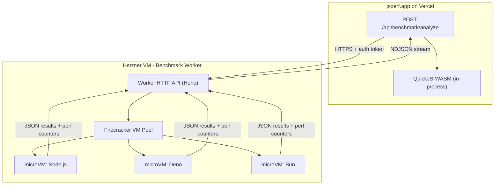

# Self-Hosted Firecracker Multi-Runtime Benchmark Worker

## Current State

The Deep Analysis pipeline in [lib/engines/runner.js](lib/engines/runner.js) orchestrates two engines:
- **QuickJS-WASM** ([lib/engines/quickjs.js](lib/engines/quickjs.js)) -- deterministic interpreter, runs in-process
- **V8/Node 24** ([lib/engines/v8sandbox.js](lib/engines/v8sandbox.js)) -- JIT profiling via `@vercel/sandbox` (Firecracker on Vercel's infra)

The API endpoint [pages/api/benchmark/analyze.js](pages/api/benchmark/analyze.js) calls `runAnalysis()` and streams NDJSON progress to the client. Results are cached in Redis and persisted to MongoDB.

## Architecture Overview



QuickJS-WASM stays in-process on Vercel (it is lightweight WASM, no external dependency). The three JIT runtimes run on the Hetzner worker inside individual Firecracker microVMs.

## Hetzner VM Selection

A **CCX13** (2 dedicated AMD vCPUs, 8 GB RAM, ~13 EUR/mo) is the sweet spot:
- **Dedicated vCPUs** -- critical for stable benchmark numbers; shared vCPU instances (CPX) have noisy neighbor variance
- `/dev/kvm` is exposed on Hetzner Cloud -- Firecracker requires it
- 8 GB RAM is enough for 2-3 concurrent microVMs (each gets 256-512 MB)
- If traffic grows, step up to CCX23 (4 dedicated vCPUs, 16 GB, ~25 EUR/mo)

Alternative: Hetzner dedicated AX42 (~39 EUR/mo) gives bare metal with full perf_event access, no nested virt overhead. Better for `perf stat` counters but more expensive.

## Part 1: Hetzner Worker Service

A standalone Node.js service (Hono + node:child_process) that manages Firecracker VMs.

### Directory structure (new repo or subdirectory)

```
worker/
  server.js            # Hono HTTP API
  firecracker.js       # Firecracker VM lifecycle (create, run, destroy)
  runtimes/
    node.js            # Node.js benchmark script builder
    deno.js            # Deno benchmark script builder
    bun.js             # Bun benchmark script builder
    common.js          # Shared benchmark loop logic
  rootfs/
    build-rootfs.sh    # Script to build Alpine rootfs images
    Dockerfile.node    # Node rootfs builder
    Dockerfile.deno    # Deno rootfs builder
    Dockerfile.bun     # Bun rootfs builder
  vmlinux              # Linux kernel binary for Firecracker
  config/
    vm-template.json   # Firecracker VM config template
  setup.sh             # VM provisioning script (installs firecracker, builds rootfs)
```

### Worker API contract

```
POST /api/run
Authorization: Bearer <WORKER_SECRET>
Content-Type: application/json

{
  "code": "...",
  "setup": "...",
  "teardown": "...",
  "timeMs": 1500,
  "runtimes": ["node", "deno", "bun"],
  "resourceProfiles": [
    { "label": "1x", "vcpus": 1, "memMb": 256 },
    { "label": "2x", "vcpus": 1, "memMb": 512 },
    { "label": "4x", "vcpus": 2, "memMb": 512 }
  ]
}

Response: NDJSON stream
{ "type": "progress", "runtime": "node", "profile": "1x", "status": "running" }
{ "type": "result", "runtime": "node", "profile": "1x", "data": { ... } }
...
```

### Firecracker VM lifecycle (per benchmark invocation)

1. Select pre-built rootfs for the target runtime
2. Write benchmark script to a scratch ext4 overlay (or use MMDS/vsock)
3. Start Firecracker process with the VM config (vcpus, mem, kernel, rootfs)
4. VM boots (~125ms with minimal kernel), runs the benchmark script, writes JSON to vsock or serial
5. Collect results, kill the Firecracker process
6. Total per-runtime overhead target: <500ms boot + benchmark time

### Runtime-specific benchmark scripts

All three runtimes share the same benchmark loop structure (time-sliced, samples-based) but differ in API usage:

- **Node.js**: `perf_hooks.performance`, `v8.getHeapStatistics()`, `process.memoryUsage()`, `--expose-gc`
- **Deno**: `performance.now()` (web standard), `Deno.memoryUsage()`, no `--expose-gc` needed (use `--v8-flags=--expose-gc`)
- **Bun**: `performance.now()`, `Bun.nanoseconds()` for high-res, `process.memoryUsage()`, `bun:jsc` for JavaScriptCore heap stats

### Rich metrics (the real payoff of self-hosted Firecracker)

Since we control the full VM, we can collect metrics not available in Vercel Sandbox:

- **CPU counters** via `perf stat -e instructions,cycles,cache-misses,branch-misses` wrapping the benchmark process
- **Startup time** -- time from process spawn to first benchmark iteration
- **GC pauses** -- `--trace-gc` (Node/Deno V8 flag), `bun:jsc` GC events
- **JIT compilation time** -- `--trace-opt` / `--trace-deopt` (V8), JSC tier-up events
- **RSS/PSS** from `/proc/<pid>/smaps` inside the VM
- **Context switches** from `/proc/<pid>/status`

## Part 2: jsperf.app Changes

### New engine file: `lib/engines/firecracker.js`

Replaces `v8sandbox.js`. Single function that calls the Hetzner worker API:

```javascript
export async function runOnFirecracker(code, {
  setup, teardown, timeMs, runtimes, resourceProfiles, signal, onProgress,
}) {
  const response = await fetch(process.env.BENCHMARK_WORKER_URL + '/api/run', {
    method: 'POST',
    headers: {
      'Content-Type': 'application/json',
      'Authorization': `Bearer ${process.env.BENCHMARK_WORKER_SECRET}`,
    },
    body: JSON.stringify({ code, setup, teardown, timeMs, runtimes, resourceProfiles }),
    signal,
  })
  // Parse NDJSON stream, call onProgress for each line, return aggregated results
}
```

### Updated runner.js

```
For each test:
  1. Run QuickJS-WASM (unchanged, in-process)
  2. Call runOnFirecracker() with runtimes: ["node", "deno", "bun"]
  3. Build prediction model from QuickJS + all three JIT runtimes
```

The results shape expands from `{ quickjs, v8 }` to `{ quickjs, node, deno, bun }`.

### Updated prediction model ([lib/prediction/model.js](lib/prediction/model.js))

- `buildPrediction()` accepts profiles from all three runtimes
- `compareTests()` compares across all runtimes, not just QuickJS vs V8
- New: **cross-runtime divergence** detection (e.g., "Bun is 3x faster on this snippet due to JSC optimization")

### Updated API ([pages/api/benchmark/analyze.js](pages/api/benchmark/analyze.js))

- Remove `@vercel/sandbox` import (no longer needed as a dependency)
- Add `BENCHMARK_WORKER_URL` and `BENCHMARK_WORKER_SECRET` env vars
- Progress stream now includes runtime name: `{ engine: 'node', ... }`, `{ engine: 'deno', ... }`, `{ engine: 'bun', ... }`

### Updated UI ([components/DeepAnalysis.js](components/DeepAnalysis.js))

- `ANALYSIS_STEPS` expands to: QuickJS-WASM, Node.js, Deno, Bun, Prediction
- [components/CanonicalResult.js](components/CanonicalResult.js) and [components/JITInsight.js](components/JITInsight.js) updated to show per-runtime columns
- New component: **RuntimeComparison** -- side-by-side bar chart of Node vs Deno vs Bun ops/sec with perf counter badges
- New component: **PerfCounters** -- table showing instructions, cycles, cache-misses per runtime

### Updated cache key

The Redis cache key in `analyze.js` should include the runtimes used, bumping to `analysis_v3:`.

## Part 3: Hetzner VM Setup

Provisioning script (`worker/setup.sh`) that:

1. Installs Firecracker binary + jailer
2. Downloads a minimal Linux kernel (`vmlinux`)
3. Builds three Alpine rootfs images (via Docker multi-stage):
   - `rootfs-node.ext4` -- Alpine + Node.js LTS
   - `rootfs-deno.ext4` -- Alpine + Deno latest
   - `rootfs-bun.ext4` -- Alpine + Bun latest
4. Sets up the worker service as a systemd unit
5. Configures firewall (only allows inbound from jsperf.app's Vercel IPs or uses Cloudflare Tunnel)
6. Sets up Let's Encrypt for HTTPS (or Cloudflare Tunnel for zero-config TLS)

### Security

- Worker API behind bearer token auth
- Firecracker VMs have no network access (no `eth0` in VM config)
- Benchmark code runs as unprivileged user inside the VM
- Rate limiting on the worker side (max concurrent VMs, per-IP throttle)
- Cloudflare Tunnel is the simplest option: no public IP exposure, automatic TLS

## Implementation Order

The work is cleanly separable into worker-side and app-side:

1. **Worker service** -- can be developed and tested independently on any Linux box with KVM
2. **App integration** -- swap `v8sandbox.js` for `firecracker.js`, update runner/model/UI
3. **Hetzner deploy** -- provision VM, deploy worker, wire up env vars
